# 🧶 The Crochet Nook

## 🏗️ User Experience

### **Project Overview**  
The Crochet Nook is a web platform where users can share, explore, and engage with crochet projects.  

### **Goals & Challenges**  
- Create a user-friendly space for crochet enthusiasts.  
- Allow easy uploading and sharing of projects.  
- Ensure a secure and engaging community.  

### **Target Users**  
- Beginner to expert crocheters.  
- Users looking for inspiration and tutorials.  
- People who want to showcase their crochet work.  

### **Research & Testing**  
- Surveys and feedback from crochet communities.  
- Usability testing for site navigation and features.  

### **Content & Features**  
A breakdown of the core functionalities available in The Crochet Nook.  

---

## ✨ Main Features

### **User Stories**  

#### **User Authentication & Profiles**  
- As a user, I want to create an account so that I can access and contribute to crochet projects.  
- As a user, I want to log in and log out securely so that my account remains protected.  
- As a user, I want to view crochet projects shared by others so that I can find inspiration and ideas. 
- As a user, I want to like and comment on crochet projects so that I can show appreciation and join the community. 

#### **Project Uploads & Management**  
- As a user, I want to add a new crochet project with images and text so that I can share my work with others.  
- As a user, I want to edit my crochet projects so that I can make corrections or updates.  
- As a user, I want to delete my crochet projects so that I can remove content I no longer want to share.  
- As a user, I want to categorize my crochet projects so that others can easily find them.  

#### **Browsing & Filtering**  
- As a user, I want to browse crochet projects so that I can find inspiration.  
- As a user, I want to filter crochet projects by category and difficulty level so that I can find patterns that match my skill level.  
- As a user, I want to search for crochet projects by keywords so that I can find specific patterns or techniques.  

#### **Engagement & Interaction**  
- As a user, I want to like crochet projects so that I can show appreciation for others' work.  
- As a user, I want to comment on crochet projects so that I can ask questions and give feedback.  
- As a user, I want to delete my comments to remove anything I no longer want to say.  
- As a user, I want to see how many likes and comments a project has so that I can gauge its popularity.  

#### **Admin & Moderation**  
- As an admin, I want to manage users so that I can ensure a positive community experience.  
- As an admin, I want to delete inappropriate projects or comments so that the platform remains safe and friendly.  

---

## 📌 Site Structure  

### **Navigation Flow**  
How users move between different sections of the site.

### **User Flow Diagram**  

The User Flow Diagram maps out every step a user takes from arriving at the homepage to doing different tasks, 
such as exploring crochet projects, posting new posts, or interacting with content, giving a clear visual depiction of how visitors will move across the website. 
This diagram illustrates the steps users take to access important features, navigate between sites, and interact with forms. 
The User Flow Diagram guarantees that the website is easy to use, intuitive, and organised to offer a smooth experience by illustrating the user journey. 
It is a useful tool for enhancing usability, streamlining navigation, and spotting possible areas for improvement. 

<details>
<summary>Flow Diagram</summary>
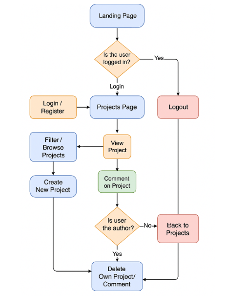
</details>

<details>
<summary>Wireframe Flow Diagram</summary>
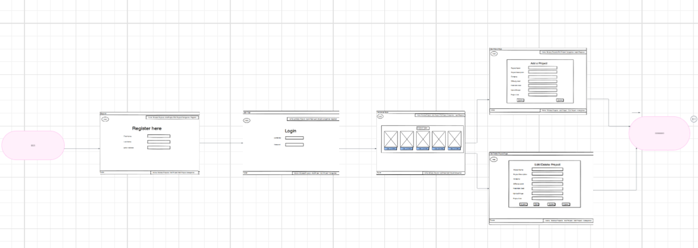
</details>

### **How Users Move Through the Site**  

- Home Page 
When visitors first arrive at the home page, they will be asked to either register or log in.

- Authentication

Users can either log in or register.

After logging in, they are redirected to the main Projects page.

- Browsing Projects

Users can view all shared crochet projects.

They can filter projects by category or difficulty.

Clicking a project opens a detailed view with images, materials, notes, and pattern instructions.

- Engagement

Logged-in users can like or comment on projects.

Users can also delete their comments.

- Creating Content

Logged-in users can create a new crochet project by filling out a form with all relevant fields.

After submission, the project is displayed in the Projects list.

- Logging Out

Users can safely log out using the navigation bar, which clears their session. 

## 📐 Wireframes

My website's wireframes serve as a basic framework for organising and arranging its overall design.
They ensure a well-organised layout that improves user experience by offering clear visual guidance for creating each page.
The wireframes outline important components like navigation, content placement, and interactive features.
which helps to expedite the design process and guarantee a logical, user-friendly flow throughout the website.


#### Desktop Wireframe 

<details>
<summary>Login Page - Desktop</summary>
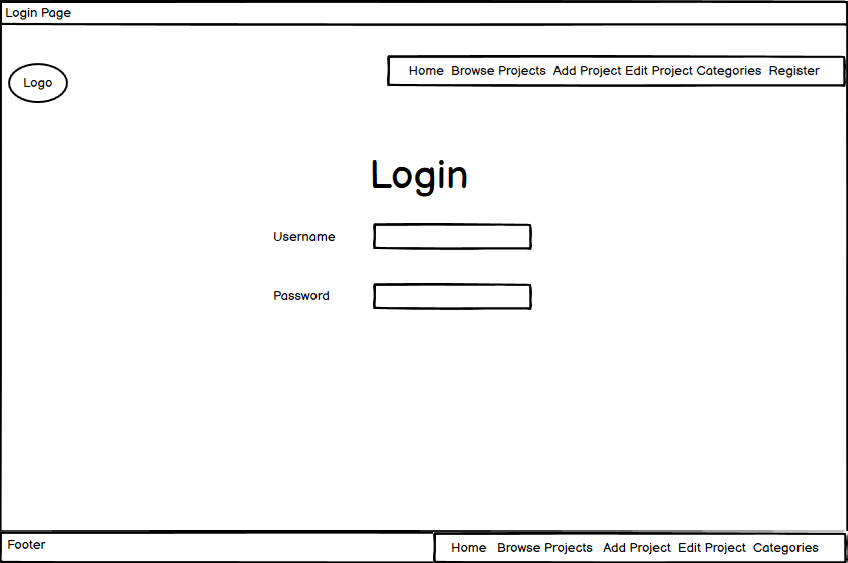
</details>

<details>
<summary>Resgistration Page - Desktop</summary>
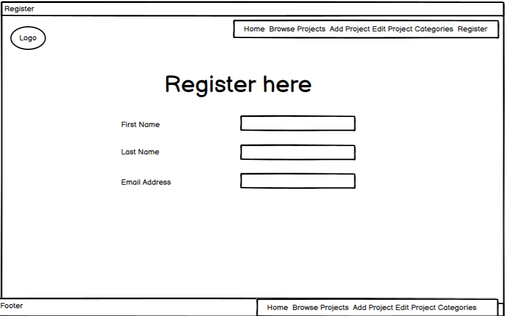
</details>

<details>
<summary>Home Page - Desktop</summary>
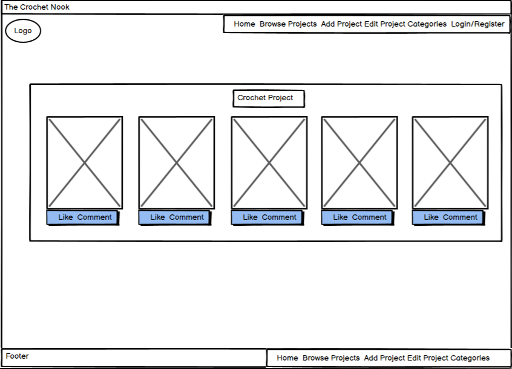
</details>

<details>
<summary>Project Page - Desktop</summary>
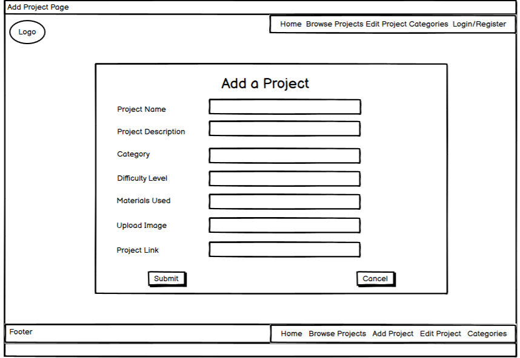
</details>

<details>
<summary>Edit Page - Desktop</summary>
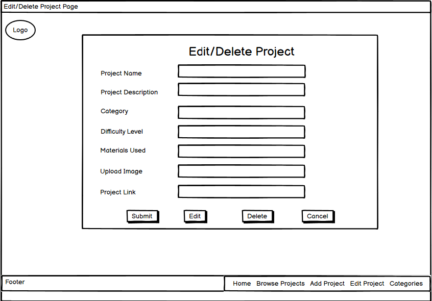
</details>

#### Mobile Wireframe 

<details>
<summary>Login Page - Mobile</summary>
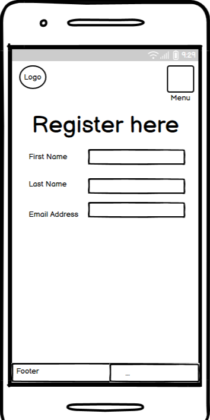
</details>

<details>
<summary>Resgistration Page - Mobile</summary>
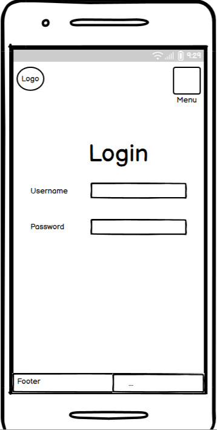
</details>

<details>
<summary>Home Page - Mobile</summary>
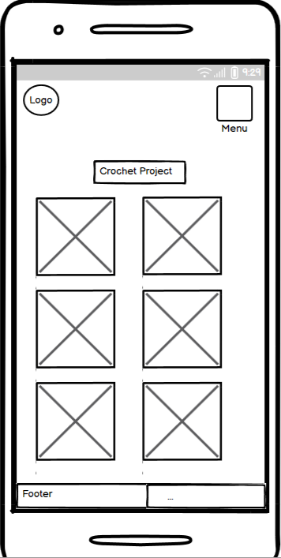
</details>

<details>
<summary>Project Page - Mobile</summary>
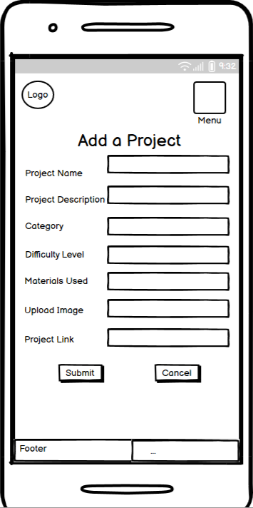
</details>

<details>
<summary>Edit Page - Mobile</summary>
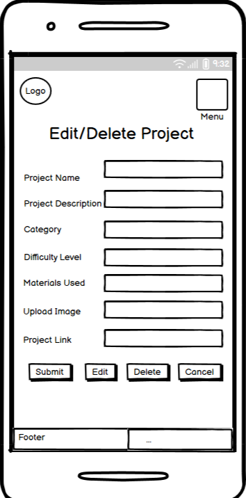
</details>

#### Tablet and iPad Wireframe 

<details>
<summary>Login Page - Desktop</summary>
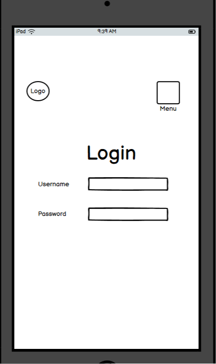
</details>

<details>
<summary>Resgistration Page - Desktop</summary>
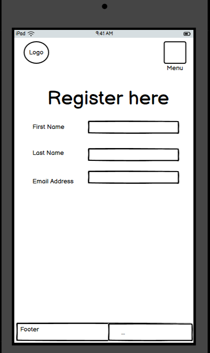
</details>

<details>
<summary>Home Page - Desktop</summary>
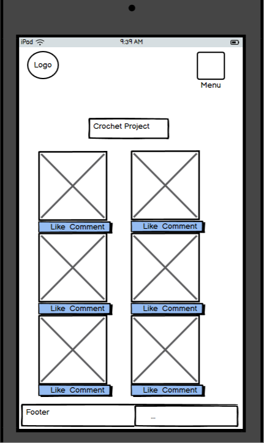
</details>

<details>
<summary>Project Page - Desktop</summary>
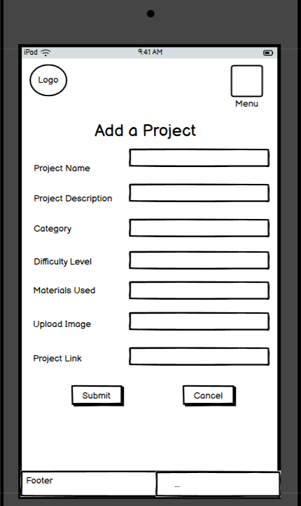
</details>

<details>
<summary>Edit Page - Desktop</summary>
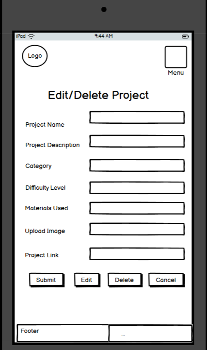
</details>

## 🎨 Design & Branding  

### **Logo**

The logo features the text "The Crochet Nook" written in a stylish, handwritten script font that gives off a cozy and personal feel. The text is in black against a light blue background, enhancing readability while maintaining a soft, welcoming aesthetic. The playful and artistic style of the font conveys a sense of creativity, fitting well with the handmade, crafty vibe typically associated with crochet.

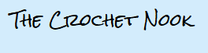

### **Colour Scheme**  

The Crochet Nook features a soft and inviting color palette that reflects the cozy, handcrafted essence of crochet. The site’s background uses a calming pastel blue (#C3E4F8), creating a gentle and welcoming atmosphere.

Content is organized using clean white cards (#FFFFFF) for clarity and contrast. Project cards are enhanced with a delicate pale pink dotted border (#FCDDE8), adding a subtle touch of charm and warmth that complements the overall pastel theme.

Each project card includes three pastel-colored buttons designed for clarity and accessibility:

- View Project: A light blue button that invites users to explore more.

- Edit: A soft yellow button that adds a cheerful, approachable tone for updates.

- Delete: A gentle pink button that maintains visual harmony while signaling caution.

This carefully curated palette ensures a cohesive, soothing, and user-friendly experience, aligning perfectly with the comforting and creative spirit of the crochet community. 

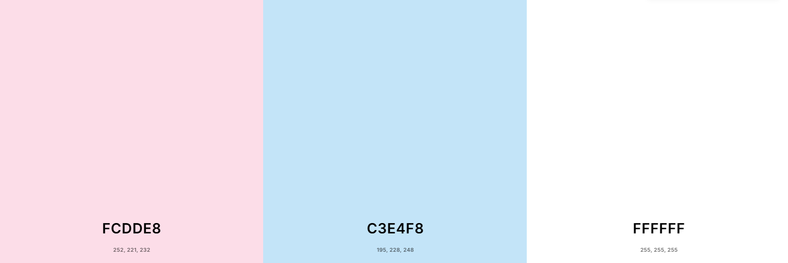

### **Typography** 

The Crochet Nook uses a combination of two fonts — Rock Salt and Quicksand — to reflect both personality and readability throughout the site.

Rock Salt:
This playful, hand-drawn font brings a handcrafted, whimsical vibe to the site. Inspired by real handwriting with a slightly rough texture, it's perfect for headings or branding elements that need a personal, artsy touch, fitting the handmade spirit of crochet.


Quicksand:
A clean, rounded sans-serif font that’s modern, friendly, and easy to read. Quicksand is used for body text and content areas, providing excellent readability while maintaining a soft and approachable look that complements the cozy aesthetic of the platform.

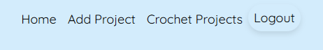

Together, these fonts strike a balance between charm and clarity — one expressive and craft-inspired, the other smooth and practical — enhancing the overall user experience with both style and substance.

### **Layout**

The page layout for The Crochet Nook is warm, welcoming, and neatly organized, featuring a grid-style interface with visually appealing images. Here’s a breakdown of the layout:

Header Section
- Text: "Welcome to The Crochet Nook"
- Large, bold, and centered at the top.
- Subtext: "Select a category to explore:"
- Smaller, friendly instructions just below the main heading.

Main Content – Category Grid
- The content is displayed in a 3-column grid layout, with two rows.
- Each category is shown inside a rounded rectangle box with:
- A high-quality image of the crochet item.
- The name of the category centered beneath the image in a clean, sans-serif font.

### **Images & Visuals**  

#### **Registration Page**

Welcome to the registration page for The Crochet Nook! Here, new users can create a personal account to start sharing their crochet projects, explore others’ work, and connect with a creative community.

The registration form includes fields for a username, a secure password, and password confirmation. Helpful password guidelines are listed to ensure your account stays safe.

At the top, the navigation bar allows quick access to key areas of the site:

Home

Add Project

Crochet Projects

Login

Register

The page design keeps a soft, welcoming tone with a light blue background, easy-to-read fonts, and a simple, user-friendly layout—just like a cozy crochet nook!

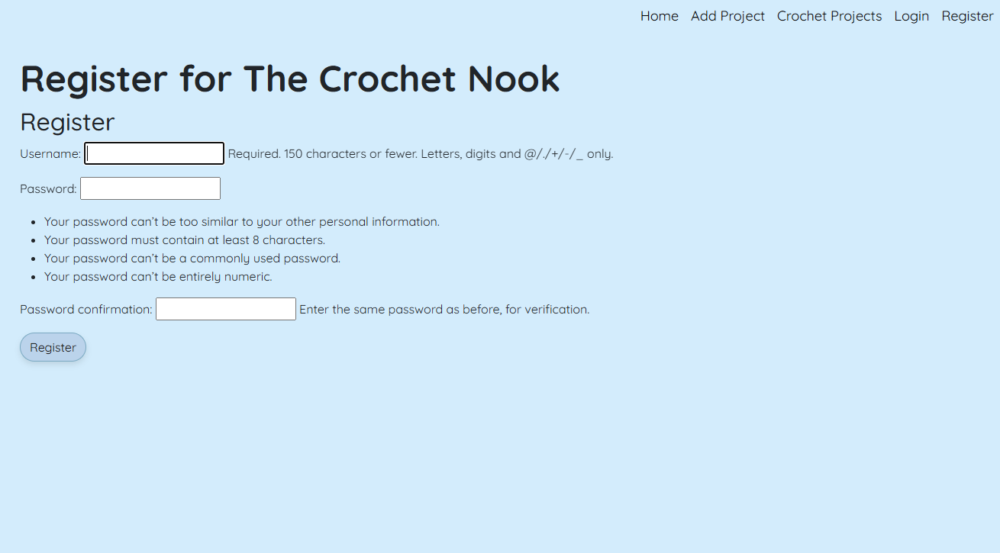

#### **Login Page**

The login page for The Crochet Nook allows returning users to securely sign in to their account. With a simple form layout, users can enter their username and password to access their crochet projects, add new creations, or interact with the crafting community.

Helpful navigation links are available in the top right corner, making it easy to:

- Home page

- Browse Crochet Projects

- Add a new project

- Register a new account

The gentle blue background and clean design make for a peaceful, user-friendly login experience—perfectly matching the warm, handmade vibe of the crochet world.

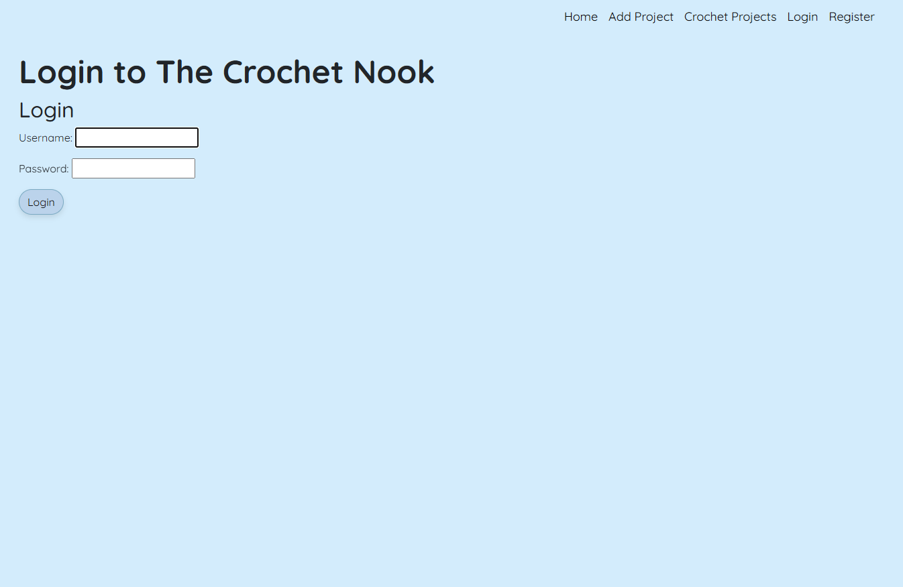

#### **Home Page**

The Welcome Page of The Crochet Nook invites users into a cozy, colorful space to explore different crochet project categories. The layout features a friendly greeting at the top followed by a prompt to select a category.

Displayed in a 2-row, 3-column grid, each category is represented with:

A vibrant, high-quality photo of a crocheted item

A label beneath each image naming the category

Categories include:

- Blankets – Warm, textured throws for cozy vibes

- Cardigans – Stylish, handmade wearables

- Amigurumi – Adorable stuffed animals and characters

- Scarves – Colorful, snug accessories

- Hats – Beanies and pom-pom topped headwear

- Dishcloths – Functional and decorative essentials

The entire layout sits on a soft blue background, reflecting the calm and creative spirit of the crochet community. Each card is spaced evenly and bordered in white, making navigation both intuitive and visually inviting.

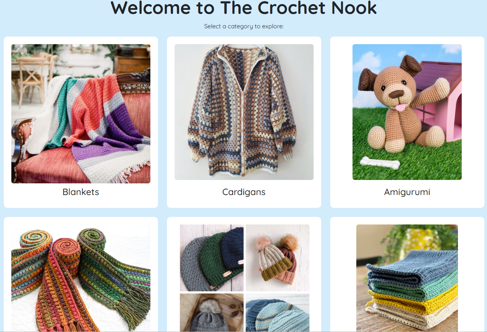

#### **Add Project Page**

The “Add a New Project” page on The Crochet Nook allows users to share their crochet creations by submitting detailed project entries. The page features a clean form layout with labeled fields for user input.

Form Fields Include:

- Project Name – A single-line text field to title the project.

- Description – A larger text area for an overview or story behind the project.

- Skill Level – A dropdown menu to select difficulty (e.g., Beginner).

- Materials Needed – A field to list yarn types, hook sizes, and other supplies.

- Category – Dropdown to categorize the project (e.g., Blanket, Hat, Amigurumi).

- Notes – Optional space for tips, modifications, or personal thoughts.

File Uploads:

- Upload Pattern (PDF) – Attach a pattern file to share with others.

- Upload Image – Upload a photo of the finished project for inspiration.

At the bottom, a rounded “Add Project” button allows users to submit their project once complete.

The page uses a soft blue background with a simple, welcoming aesthetic, keeping the focus on creativity and contribution.

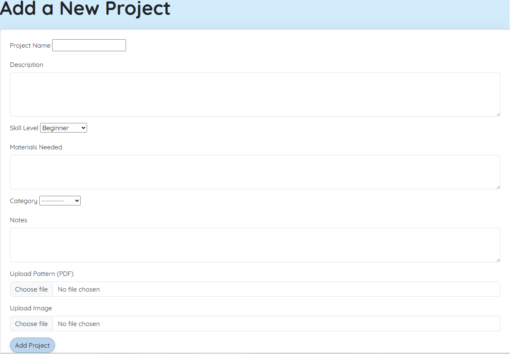

#### **Crochet Project Page**

The Crochet Projects page is a beautifully laid-out collection of user-added crochet patterns. It serves as a gallery where each project is presented with a preview, allowing users to browse, view, edit, or delete their creations.

Page Layout & Features:

Add New Project Button:

Located at the top, this button allows users to quickly navigate to the form for submitting a new crochet project.

Project Cards:

Each project is displayed within an individual, color-bordered card.

Image Preview: A photo representing the crochet project.

Project Title: Clearly stated at the top of the card.

Short Description: A summary of the project’s charm and purpose (truncated for quick browsing).

Skill Level: Shows the required experience: Beginner, Intermediate and Advanced.

Category: Organizes the project type Blankets, Cardigans, Amigurumi, Hats, Scarves and Dishcloths.

Action Buttons:

View Project: Takes the user to the full project description and downloadable resources.

Edit: Allows the user to update any project details.

Delete: Removes the project from the list.

Design:
Uses soft pastel colors and a dotted border for each card to give a handcrafted, friendly vibe.

Clear layout promotes easy navigation and interaction with each project.

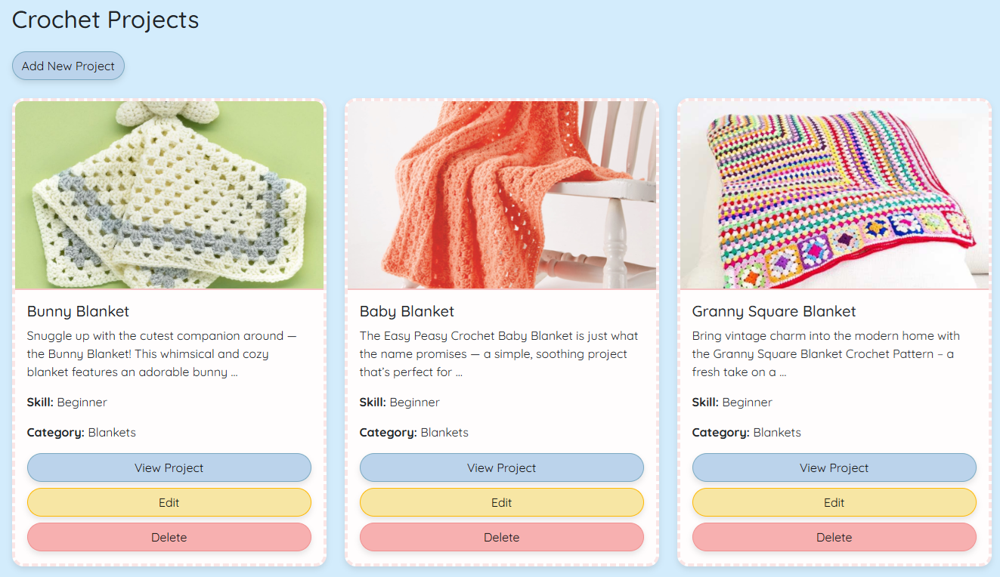

#### **Blanket Project Page**

This page is a "Blankets Projects" section from a crochet-themed website, likely part of The Crochet Nook or My Crochet Page. It displays six crochet blanket project cards in a visually appealing grid layout, using a soft, pastel color palette with a light blue background. Each card includes:

Project Name Bunny Blanket, Baby Blanket and more.

Image of the blanket

Brief Description of the project

A "View Project" button styled with a blue border and hover effect

The six featured blanket projects are:
Bunny Blanket – A cozy blanket with an adorable bunny theme.

Baby Blanket – A simple, soothing baby blanket ideal for beginners.

Granny Square Blanket – A vibrant, colorful take on a traditional granny square design.

Lattice Blanket – Elegant with a textured design, great for home decor.

Shell Blanket – Features pastel shell stitch patterns, soft and elegant.

Cat and Mouse Blanket – Whimsical and fun, featuring cat and mouse motifs.

Each project is likely clickable for more details. The layout and card style are consistent and user-friendly, making it easy to browse.

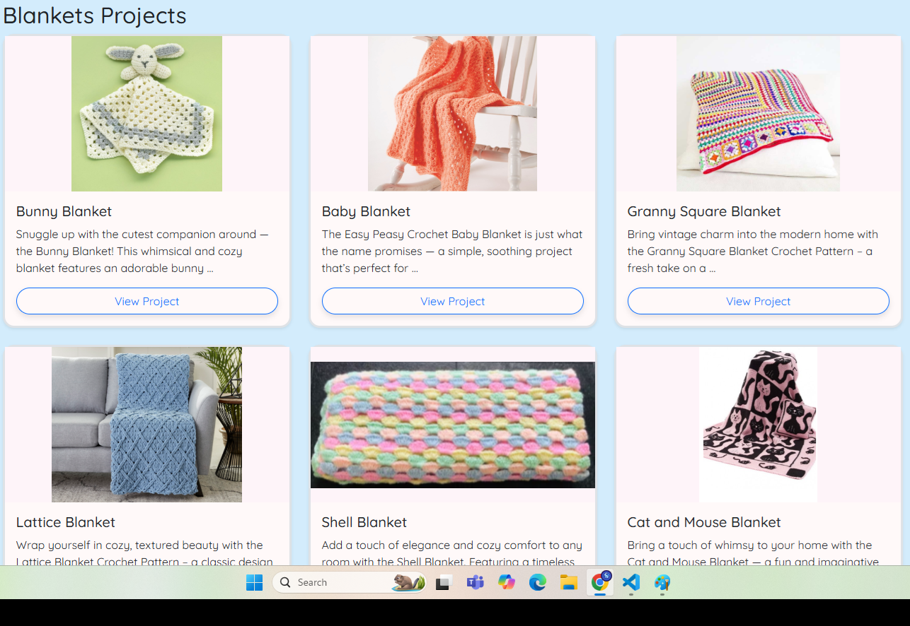

#### **Cardigan Project Page**

This page is the "Cardigans Projects" section of your crochet-themed website. It follows the same clean, pastel-toned design as the “Blankets Projects” page, with a light blue background, rounded white cards, and consistent card layout.

Each card includes:
A project image

Project title in bold

A brief description of the project

A blue-bordered "View Project" button

The featured cardigan projects are:
Adult Crew Neck Sweater – A timeless and versatile casual sweater.

Matinee Jacket – A warm and elegant jacket, ideal for babies or special occasions.

Gathering Leaves Cardigan – A charming, fall-themed cardigan with swirling leaf motifs.

Iris Cardigan – A long, elegant cardigan perfect for layering, featuring a classic design.

Peggy Cardigan – A red cardigan with a relaxed fit, adding subtle elegance to casual outfits.

Baby Cardigan – A soft and stylish option for babies, with matching booties in the image.

Design Notes:
The cards have consistent sizing and styling.

The descriptions are concise and inviting.

Button design matches the “Blankets Projects” section, ensuring visual harmony.

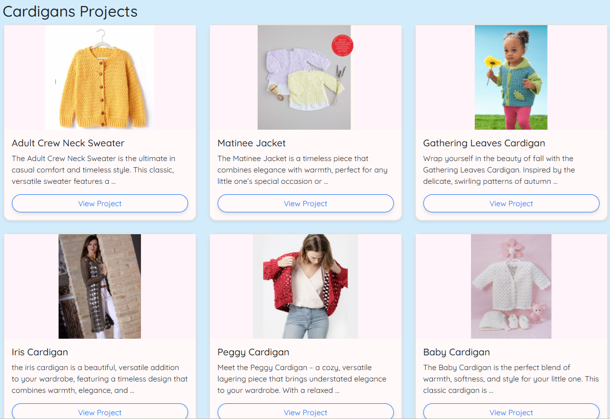

#### **Amigurumi Project Page**

This is the "Amigurumi Projects" section of your crochet website, showcasing cute and creative crocheted characters and toys. It follows the same consistent and visually cohesive design as the other project sections, with a pastel blue background and clean white project cards.

Each card includes:
An image of the amigurumi character

A project title

A short description

A "View Project" button with a blue outline

The featured Amigurumi projects:
Barnyard Friends Collection – A group of adorable farm animals including a pig, chick, and lamb.

Bumble Bee Keyring – Small, cheerful bee keychains to brighten your day.

Octopus – A soft, stackable octopus plushie with wiggly legs and friendly faces.

Penguin – A cute, chubby penguin plushie with flipper wings and a tiny beak.

Pikachu – A crocheted version of the beloved Pokémon character, full of energy and fun.

Disney Stitch – A playful Stitch plushie, full of mischief and charm.

Design Highlights:
The layout is neatly arranged in two rows of three cards.

The images are vibrant and engaging, perfect for grabbing attention.

The tone is whimsical and lighthearted, matching the amigurumi theme well.

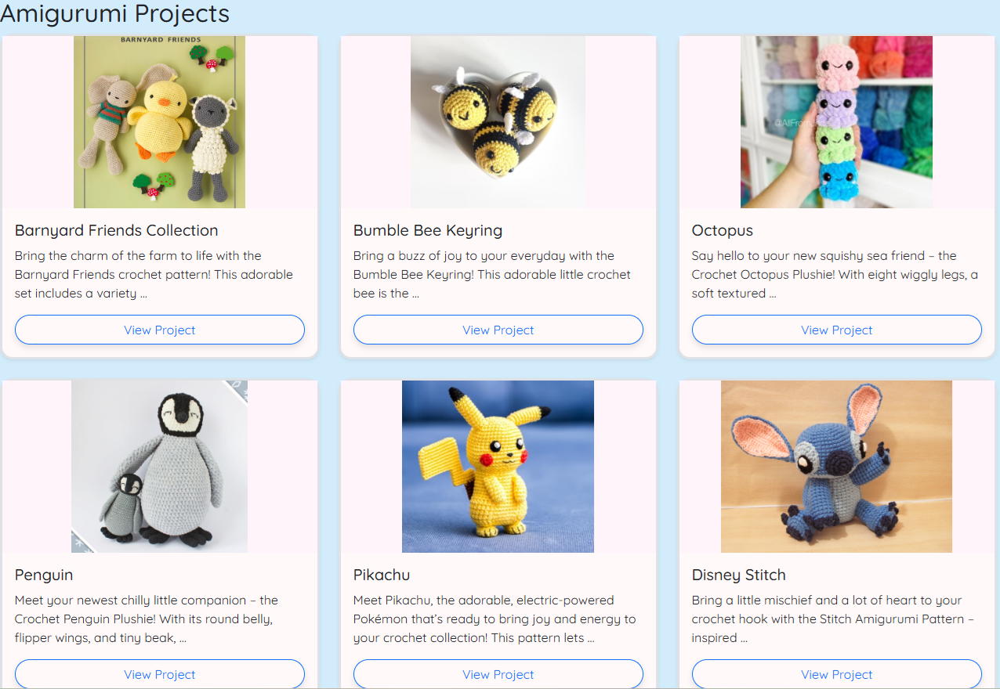

#### **Scarf Project Page**

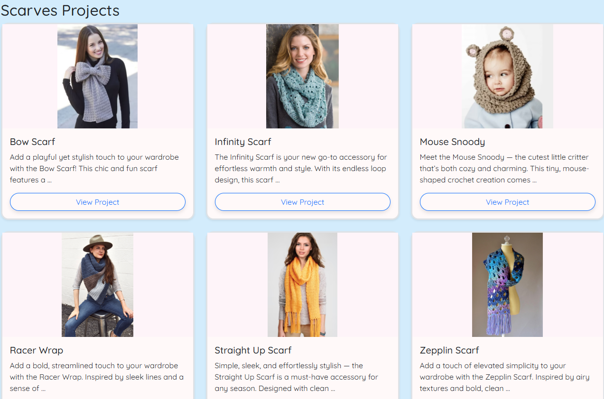

This is the "Scarves Projects" section of your crochet website, dedicated to stylish and cozy accessories perfect for any season. It keeps the same cohesive design as the rest of the site, featuring a soft pastel blue background and crisp white project cards.

Each card includes:

An image of the scarf

A project title

A short, catchy description

A "View Project" button with a soft blue outline

The featured Scarf projects:

Bow Scarf – A chic scarf with a playful bow detail, blending style and whimsy.

Infinity Scarf – An endlessly looped scarf for effortless layering and warmth.

Mouse Snoody – A cute, critter-themed snoody with cozy character and charm.

Racer Wrap – A bold, modern wrap with clean lines and sleek design.

Straight Up Scarf – A minimal and timeless scarf that pairs with anything.

Zepplin Scarf – Airy and modern, this scarf adds elevated simplicity to your look.

Design Highlights:

Projects are displayed in a clean two-row, three-column grid for easy browsing.

Each image showcases the scarf clearly, inviting users to explore further.

The tone is cozy, stylish, and inviting — just like the scarves themselves.

#### **Hat Project Page**

This is the "Hats Projects" section of your crochet website, showcasing cozy and creative headwear for all styles and seasons. The design remains consistent with the rest of the site — a soft pastel blue background with clean, white project cards that make each item pop.

Each card includes:

An image of the crochet hat

A project title

A short, engaging description

A "View Project" button outlined in soft blue

The featured Hat projects:

Cinnamon Swirl Hat and Scarf Set – A warm, coordinating set inspired by cozy cinnamon tones and classic style.

Beginner Beanie – A simple and approachable pattern, perfect for first-time crocheters or relaxing weekend projects.

Candy Cap – Bright, sweet, and full of fun — this playful hat brings a splash of color to any outfit.

Elegant Hat – A refined accessory with timeless charm, perfect for dressing up or down.

Fox Hat – A woodland-inspired design featuring fox ears and adorable detailing for a whimsical touch.

Pebbled Hat – A textured beanie with a stylish “pebbled” surface, offering both warmth and visual interest.

Design Highlights:

Projects are arranged neatly in a two-row, three-column grid for easy browsing.

Each hat is presented with a vibrant image to capture its unique flair.

The tone is playful, stylish, and cozy — matching the warm and creative vibe of the hat category.


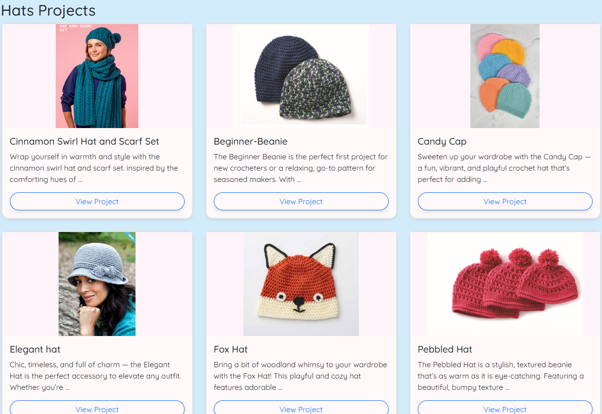

#### **Dishcloth Project Page**

This is the "Dishcloth Projects" section of your crochet website, featuring a collection of functional and decorative crochet patterns for the kitchen and home. Staying true to the site’s aesthetic, the section is presented with a soft pastel blue background and clean white project cards for a cohesive, inviting look.

Each card includes:

An image of the dishcloth or coaster

A project title

A short, friendly description

A "View Project" button outlined in blue

The featured Dishcloth projects:

Dishcloth and Tea Towel – A simple and elegant set that blends style and function for your daily kitchen needs.

Corgi Butts Coasters – Playful and adorable, these coasters bring a smile with every fluffy-tailed corgi design.

Fantasy Naturale – A bright and practical dishcloth that highlights natural cotton yarn in bold, fun colors.

Holi Inspired Dishcloth – A festive and colorful design inspired by the joyful hues of the Holi celebration.

Sunburst Coaster – Radiating texture and cheer, this sunny coaster adds handmade warmth to any table.

Snowflake Coaster – Delicate and elegant, this winter-themed design adds a touch of seasonal magic to your décor.

Design Highlights:

All project cards are arranged in a neat two-row, three-column grid.

Images are bright and showcase the texture and shape of each dishcloth clearly.

The tone is cheerful and homey, matching the comforting, everyday nature of dishcloths and coasters.


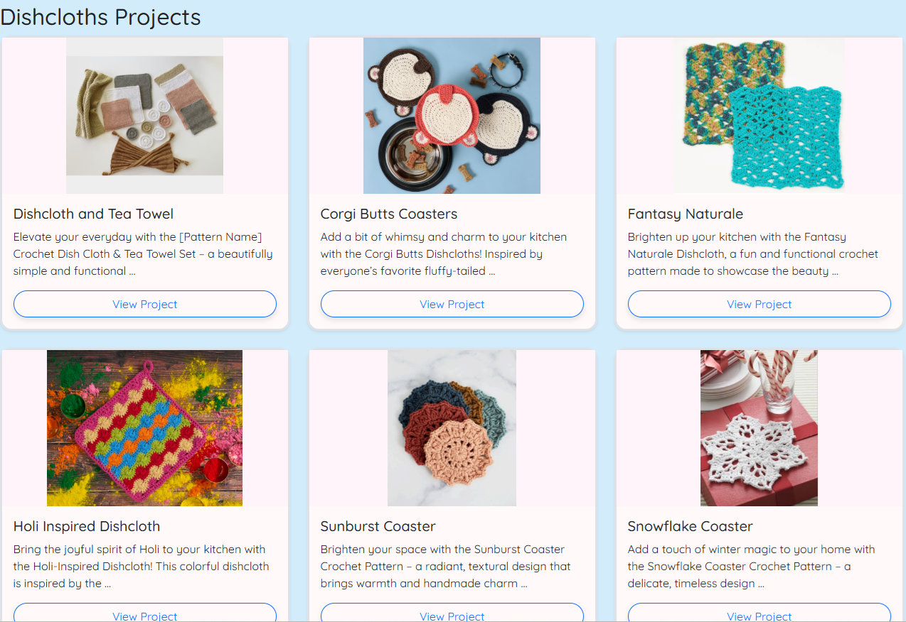

#### **Edit Project Page**

This is the "Edit Project" section of your crochet website, where you can easily update or refine the details of your crochet projects. The page has been designed to ensure a smooth and intuitive editing process, all while keeping in line with the clean, inviting aesthetic of the site.

Each section includes:

Project Title: Edit the name of your crochet creation.

Category: Choose the most fitting category for your project, such as Blankets, Scarves, or Dishcloths.

Description: Add or update a friendly, short description that highlights the details of your project.

Skill Level: Adjust the difficulty level to guide crocheters of all abilities.

Materials Needed: List the yarns, hooks, and any additional supplies required.

Notes: Include any important tips or special instructions for makers.

Pattern: Attach or change the pattern if available for download or printing.

Image: Update or upload an image that showcases your project.

Design Highlights:

The page is clean and minimalist, with fields clearly outlined for easy editing.

All updates are immediately visible, with an option to preview changes before finalizing.

The soft pastel theme creates a welcoming, user-friendly interface that aligns with the overall aesthetic of the site.

Once you’ve made your changes, don’t forget to save and share your updated creation with the crochet community!

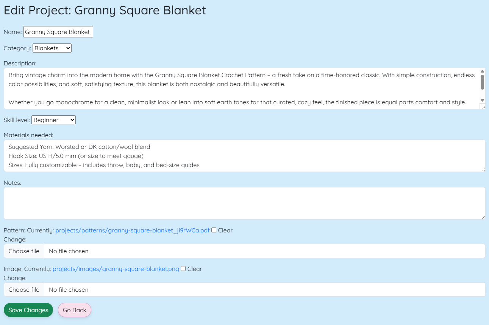

#### **Project Description Page**

The Project Description Page gives users a detailed view of a specific crochet project. The layout is visually appealing and user-friendly, combining both image and text to deliver all essential information about the pattern.

Image Display: A large image of the finished crochet project is prominently shown on the left side to give users a visual reference of the outcome.

Project Information Section (Right Side):

The title of the project is displayed in bold, large font.

Category the project falls under (e.g., Amigurumi).

Description providing a detailed overview of the project, its inspiration, and what makes it special.

Skill Level to help users determine difficulty.

Materials needed are listed clearly for ease of preparation.

Notes section for any extra information or tips (optional).

Interactive Buttons:

A “Download Pattern” button for users to access the project PDF.

A “Like” button with a heart icon and a count, allowing users to express appreciation for the pattern.

Design & Layout:

Light background with clean font styling.

Elements are spaced and aligned for readability.

The navigation bar at the top provides access to other key sections like Home, Add Project, Crochet Projects, and Logout.

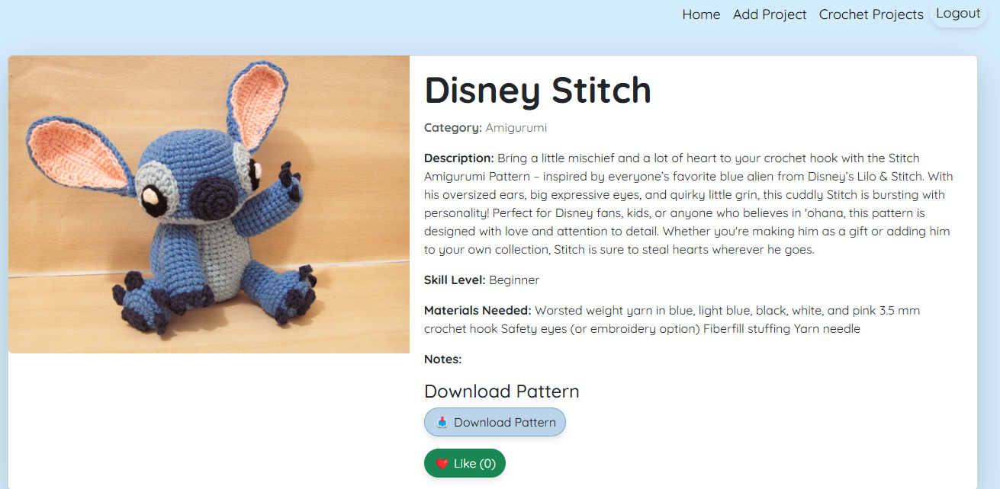


### **Accessibility**  

Ensuring that The Crochet Nook is accessible to all users, including those with disabilities, has been a key focus during the development of this web application. Several strategies have been implemented to enhance the accessibility of the site.

Text Contrast
High Contrast: The application follows the Web Content Accessibility Guidelines (WCAG) by ensuring sufficient contrast between text and background elements. This improves readability for users with visual impairments, such as those with color blindness or low vision.

Color Scheme: A pastel color palette is used, with careful attention to contrast ratios to meet accessibility standards. This ensures that text is legible against background colors and that users can easily distinguish content.

Alt Text for Images
Descriptive Alt Text: All images on the website, including those used in project cards and category sections, have appropriate alternative (alt) text. This text provides a description of the image for users who rely on screen readers or have images disabled.

Contextual Relevance: Alt text descriptions are kept concise but descriptive enough to convey the context of each image, ensuring users who cannot see the images still understand their content.

Keyboard Navigation Support
Keyboard Accessibility: The website is designed to be fully navigable via keyboard. Users can use the Tab key to move through interactive elements such as links, buttons, and form fields, and the Enter key to activate them.

Focus Indicators: Visual indicators (such as outline borders) are provided when a user focuses on a clickable element, ensuring that keyboard users can easily identify where they are on the page.

Accessible Forms: All forms, including the login, registration, and project submission forms, have proper labeling and are navigable using the keyboard, ensuring that users with mobility impairments can interact with them easily.

By implementing these accessibility features, The Crochet Nook strives to provide an inclusive experience for all users, regardless of their abilities or disabilities.

## 🗄️ Database & Backend  

### **Data Structure & Relationships**  
Database Design for The Crochet Nook
When designing an efficient and user-friendly database for The Crochet Nook, we followed a structured approach consisting of the following phases:

Requirements Analysis - Identifying the purpose of the database

Organizing Data into Tables - Determining the database structure

Normalizing to Standardize the Tables

Source: Lucidchart Database Diagram / Database Design

1. Requirements Analysis - Identifying the Purpose of the Database
The first phase of the database design process involved clearly understanding the purpose of the database for The Crochet Nook. The primary objective was to create a platform where users can share crochet projects, interact with other users through comments and likes, and explore crochet projects categorized by type and difficulty.

To complete this phase, we gathered insights from potential users to determine the types of information they expect to interact with when visiting a crochet project platform. Through user interviews and research into similar crochet-sharing platforms, we identified key features needed for the website, such as:

Project Details: Each crochet project should have detailed information like project title, description, images, and category.

User Interactions: Users must be able to like and comment on projects.

Categorization: Projects should be organized into categories like blankets, scarves, hats, and more, to make browsing easier.

User Authentication: Since only registered users can like, comment, and upload projects, user authentication was a priority feature.

2. Organizing Data into Tables - Determining the Database Structure
The second phase involved organizing the collected requirements into a structured format that could be translated into database tables. This process included determining the necessary tables, their fields, and how they relate to each other.

In this phase, we identified the following real-world entities that would be represented in the database:

Users: Store user details and authentication information.

Crochet Projects: Include project details like title, description, images, and category.

Categories: Organize crochet projects into predefined types like blankets, scarves, etc.

Comments: Allow users to comment on crochet projects.

Likes: Enable users to like crochet projects.

Each of these entities was translated into its own table:

User Table: Contains fields for user details such as username, email, and password.

Crochet Project Table: Contains project details, category, user (creator), and image fields.

Category Table: Contains the name and description of each category.

Comment Table: Links to both a user and a crochet project and stores comment content.

Like Table: Links to both a user and a crochet project and stores information about user likes.

We also mapped the relationships between these tables. This step is critical for understanding how the data interacts:

One-to-Many Relationships:

A User can create many Crochet Projects.

A Category can have many Crochet Projects.

Many-to-Many Relationships:

A User can like many Crochet Projects, and a Crochet Project can be liked by many Users. This was resolved by creating a Like table to handle the many-to-many relationship.

After analyzing the relationships and cardinalities, we refined the structure and ensured that the data was efficiently divided into the correct tables.

3. Normalizing to Standardize the Tables
Normalization is crucial for maintaining database integrity and reducing redundancy. The Crochet Nook’s database was designed to ensure that each piece of data was stored only once and that there were no unnecessary duplicates across tables.

Normalization was done using the following guidelines:

First Normal Form (1NF): Ensured that all fields in the database contained atomic values, meaning each field in a table holds only one value.

Second Normal Form (2NF): Eliminated partial dependencies by ensuring that non-key attributes were fully dependent on the primary key.

Third Normal Form (3NF): Removed transitive dependencies, ensuring that non-key attributes were directly dependent on the primary key and not on other non-key attributes.

For example, the Project Table will not have duplicate data for categories. Instead, categories are stored separately in a Category Table, which links back to the project via a foreign key. This helps avoid repeating category data in each crochet project entry.

Additionally, each User is linked by a foreign key to their Crochet Projects, Comments, and Likes, ensuring that user-related data is normalized and not duplicated across multiple tables. 

Backend Architecture
Overview of the Backend: Describe the overall structure of the backend, including the technologies used such as Django, Python, and PostgreSQL.

Framework and Tools: Explain why you chose Django and any other libraries or tools being used, for example, Gunicorn for server deployment and Heroku for hosting.

Models
Django Models: Include an overview of your Django models, explaining their purpose and structure, such as your User, Project, Comment, Like, and Category models.

Field Types: Describe the field types used in each model, for example, CharField, IntegerField, and ImageField, and explain why each was chosen.

Relationships: Explain how models are related, such as one-to-many or many-to-many relationships, and how Django's ORM manages these relationships.

Database Design and Schema
This section will include details about how your models map to actual database tables and how they are optimized for performance and scalability. You will also explain indexing, normalization, and other optimizations you applied.

Views and URLs
Views: Describe the core views that interact with your database, such as views for creating, reading, updating, and deleting projects, comments, and likes.

URL Routing: Explain how your URLs are structured and how they link to specific views. For example, URLs for accessing crochet project categories or specific user profiles.

User Authentication and Authorization
Django User System: Detail how Django’s built-in user authentication system is set up, such as sign-up, login, and logout processes.

Permissions: Mention how permissions are managed to ensure only authenticated users can perform actions like commenting or liking a project.

Forms and Validation
User Input: Describe any forms such as project submission forms and comment forms, as well as the validation rules applied to them.

Error Handling: Explain how form errors are handled and communicated to the user.

CRUD Functionality
Create, Read, Update, Delete: Explain how CRUD operations are implemented for the models and how the backend ensures data integrity during these operations.

APIs
If your backend includes any APIs, explain how the API endpoints are structured, what data is being sent or received, and how the API is secured.

Security
Data Security: Describe any measures you've implemented to secure user data, such as password hashing and using HTTPS.

Input Validation: Explain any input validation techniques to prevent malicious input, such as SQL injection and cross-site scripting.

Deployment
Hosting: Describe how the backend is deployed on Heroku and any environment variables or configuration settings you’ve set up.

Database Hosting: Mention how the PostgreSQL database is set up on Heroku and how data is managed between the production environment and your local development setup.

Scalability: If you’ve taken steps for scalability, such as database optimizations and multi-dyno setup in Heroku, briefly mention them.

Logging and Monitoring
Logs: Explain how logs are monitored to troubleshoot issues, such as using Heroku logs.

Error Tracking: Mention any tools you’re using for tracking errors in production.

### **User Accounts & Security**  

User Accounts & Security
User Authentication
Django User System: User authentication is implemented using Django’s built-in authentication system. This includes features for user registration, login, and logout.

Authentication Process: The process for users includes account creation, signing in, and session management. Django's AuthenticationForm and LoginView are used to handle these operations.

Password Handling: User passwords are securely stored by Django using hashing algorithms, ensuring that no plain-text passwords are saved in the database.

User Registration
Account Creation: Users can create an account by providing necessary details like username, email, and password.

Account Verification: Users may be required to verify their email address via an activation link sent to their inbox, ensuring their email is valid.

Authorization and Permissions
Role-Based Access: The system distinguishes between different types of users such as regular users and admins. Each user role is assigned different permissions.

Permission Management: Permissions control what users are allowed to do. For example, regular users can view projects but only registered users can add their own crochet projects.

Session Management
Session Security: Sessions are handled securely by Django, using cookies that store session data for the user. Secure cookies are used to prevent unauthorized access.

Session Expiry: Sessions may expire after a certain period of inactivity or after a specified amount of time to enhance security.

Data Security
Encryption: Sensitive data, including passwords, are encrypted and stored securely. Django uses the PBKDF2 algorithm for password hashing.

HTTPS: The application uses HTTPS to ensure all data transmitted between the user and the server is secure.

Two-Factor Authentication: If two-factor authentication is implemented in the future, users will be able to enable it to further secure their accounts.

Input Validation and Security
Form Validation: User input is validated to ensure that email formats are correct, passwords meet strength requirements, and to prevent malicious inputs.

Security Best Practices: Django’s built-in protections such as protection against cross-site request forgery and clickjacking ensure that the app remains secure. User inputs are sanitized to prevent malicious code execution.

Account Recovery
Password Reset: Users can reset their passwords through an email verification link. A secure token is generated to allow users to change their password.

Account Deletion: Users may have the option to delete their accounts, ensuring that all associated data is safely removed from the system.

Logging and Monitoring
User Activity Logging: User activities such as logging in, adding projects, or making comments may be logged for monitoring and troubleshooting purposes.

Error Monitoring: Errors related to user security or authentication are logged to help identify and address issues quickly.

Security Best Practices
Security Audits: Regular security audits are conducted to ensure the integrity of the application. This includes checking for vulnerabilities and testing for potential breaches.

Security Updates: The software stack, including Django and third-party libraries, is kept up to date with the latest security patches to protect against known vulnerabilities.

## 🔧 Technology & Tools  

### **Languages & Frameworks**  
Python
Primary Language: Python is the main programming language used for backend development in the project. It is well-suited for web development due to its simplicity, scalability, and support for a wide range of libraries and frameworks.

Django: The web application is built using the Django framework, which is a high-level Python web framework that allows rapid development of secure and maintainable websites. Django handles much of the heavy lifting, such as URL routing, authentication, form handling, and database management.

Django ORM: The Django ORM (Object-Relational Mapping) is used to interact with the PostgreSQL database. It simplifies database queries by allowing developers to use Python code instead of raw SQL, making database interactions more intuitive.

HTML5
Structure and Layout: HTML5 is used to define the structure of the web pages. It provides the foundation for the user interface, including elements like forms, tables, and multimedia content.

Semantic HTML: The application uses semantic HTML elements such as header, footer, article, and section to improve accessibility and search engine optimization.

CSS3
Styling: CSS3 is used for the visual presentation of the web pages. It is responsible for the layout, colors, fonts, and overall design of the application.

Responsive Design: The site is designed to be fully responsive using media queries, ensuring it works well on devices of all sizes, from desktops to mobile phones.

Custom Styles: Custom styles are written in CSS to ensure the user interface matches the desired look and feel, using a pastel color scheme and a consistent design across the site.

JavaScript
Interactivity: JavaScript is used to enhance user experience by adding interactivity to the website. This includes dynamic content updates, form validation, and real-time user feedback.

AJAX: Asynchronous JavaScript and XML (AJAX) is used to send requests to the server without refreshing the page, improving the user experience by making interactions feel more responsive.

Bootstrap
Frontend Framework: Bootstrap is used to ensure that the application has a responsive and visually appealing layout. It includes pre-built CSS and JavaScript components, such as navigation bars, modals, and buttons, which speed up the development process.

Grid System: Bootstrap’s grid system is used to create a flexible layout that adjusts to different screen sizes, making the application mobile-friendly.

PostgreSQL
Database: PostgreSQL is the relational database used to store data for the web application. It is chosen for its robustness, support for complex queries, and compatibility with Django’s ORM.

Schema: The database schema includes tables for user information, crochet projects, comments, likes, and categories. Django’s migrations are used to manage the database schema and ensure data integrity.

Gunicorn
WSGI Server: Gunicorn is used as the Web Server Gateway Interface (WSGI) server for the application. It is responsible for handling HTTP requests and passing them to the Django application for processing.

Deployment: Gunicorn is used in conjunction with Heroku to deploy the application in a production environment, ensuring the server can handle multiple simultaneous requests.

Heroku
Deployment Platform: Heroku is the cloud platform where the web application is deployed. It simplifies the deployment process by providing a platform-as-a-service (PaaS) environment, allowing you to focus on development without worrying about server management.

Heroku Postgres: The application uses the PostgreSQL database provided by Heroku for production, enabling seamless database management in the cloud.

Environment Configuration: Environment variables, such as database credentials and secret keys, are stored securely using Heroku's configuration system.

### **Future Improvements**  
- Planned features and enhancements.  

## 🚀 Getting Started  

### **How to Install & Run the Project**  
1. Clone the repository:  
   ```sh
   git clone https://github.com/louisesykes198/The-Crochet-Nook.git
   cd The-Crochet-Nook
